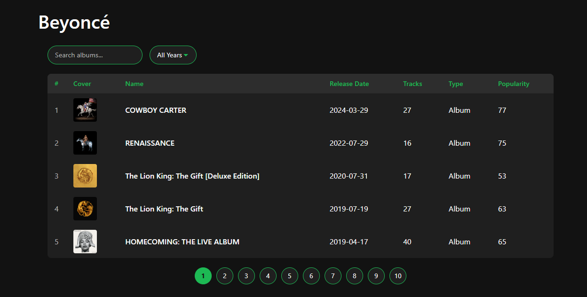
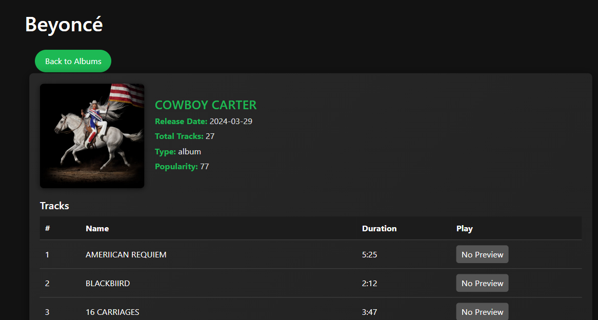

# SpotifyAlbum

## Setup Instructions
1. Clone the repository
2. Run `npm install`
3. Replace `ACCESS_TOKEN` in `AlbumList.tsx` and `AlbumDetail.tsx` with a valid Spotify access token
4. Run `npm start`

## Approach
- Used Create React App with TypeScript
- Implemented routing with react-router-dom
- Used Bootstrap for UI components
- Fetched data from Spotify API using axios
- Managed state with React hooks

## Screenshots

### 🎵 Album List Page

### 💿 Album Detail Page

